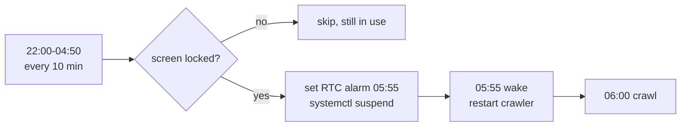

# dotfiles

## Usage

### Initial Setup

```sh
# Run bootstrap script (automatically clones repository and runs full setup)
sh -c "$(curl -fsSL https://raw.githubusercontent.com/Asuforce/dotfiles/master/scripts/bootstrap.sh)"

# Restart your shell
exec $SHELL -l
```

### Subsequent Setup

Navigate to the repository and use Make:

```sh
cd ~/dev/src/github.com/Asuforce/dotfiles

# Run complete setup
make all

# Or run individual setup targets
make link      # Create dotfile symlinks
make brew      # Install Homebrew packages (macOS)
make pkg       # Install Linux packages from config/packages/linux.txt (omarchy)
make macos     # Apply macOS settings
make llm       # Setup Claude Code configuration
make runtime   # Setup language runtimes
make xcode     # Install Xcode Command Line Tools

# Show available targets
make help
```

### omarchy (Arch Linux)

`make all` branches on `uname -s`: on Linux it runs `pkg → link → llm → runtime`
and skips the macOS-only targets. Several files are replaced by the repo's
version (omarchy's seeded copy is deleted; `~/.ssh/config` alone is kept as
`config.omarchy.bak`). Read the output of `make link` for `skipped, already
exists` and `replaced`/`removed`/`moved aside` lines.

### Always-on server host (omarchy)

`make home-server` turns the laptop into the host for the mf-dashboard stack (Docker Compose) without keeping it awake all day. It is not part of `make all`, so a machine never opts itself in. Run it on the machine that hosts the stack, then reboot once so logind picks up the lid setting.

The lid no longer suspends the machine. From 22:00 the laptop suspends only after the screen has locked, which Omarchy does after 5 idle minutes or on lid close, so it is never put to sleep while in use. It wakes at 05:55 and restarts the crawler container, because supercronic's timer does not advance while suspended and would otherwise fire late. The crawler runs at 06:00.



On a late night, run `stay-awake` in a terminal and stop it with Ctrl-C; while it runs the suspend is refused. A user timer shows a go-to-bed popup at 22:00 when the screen is unlocked. `config/home-server/` holds the sources: system files are rendered with the user name and copied with `sudo`, user files are linked, and a marked block is appended to `~/.config/hypr/bindings.lua` that blanks the panel on lid close.

### Personal Machines

A few applications in the `Brewfile` are gated on `if personal`, because on
some machines they are provisioned outside Homebrew. Homebrew installs them
only where this marker exists, so create it before `make brew` on a machine
that manages its own applications:

```sh
make personal
```

That creates the empty, untracked marker `~/.config/dotfiles/personal`.
Run `brew bundle list --all` to confirm which entries are active.

