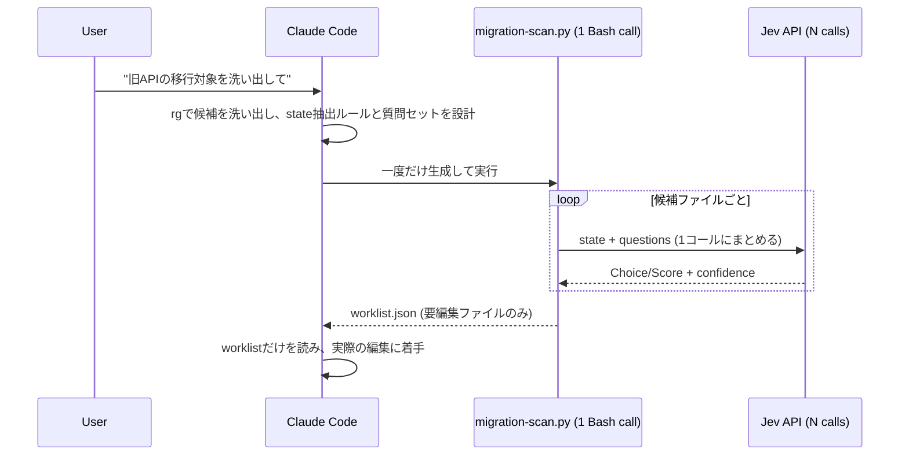

# Jev as a batch pre-filter in front of Claude Code, not a Claude Code replacement

Started from "can TypeSafe AI's Jev cut Claude Code token spend by taking over
routine tasks like commits." Jev turns out to be a typed-decision model, not a
generator: it answers `Choice`/`Score`/`Noul` questions over a bounded answer
space in 70-500ms at $0.042/Mtok input (output free), but produces no free
text at all. It cannot write a commit message, a PR body, or edited code, so
the "hand it routine work" framing doesn't hold — anything requiring
generation still has to go through Claude Code.

Surveyed where it does fit: PR/CI triage, risk scoring, log/alert
deduplication, stale-comment scanning, and large-scale refactor/migration
pre-filtering. Picked the last one to work through concretely, since it's the
clearest match for Jev's actual strength — a bounded, high-frequency,
per-file classification that currently costs a full Claude Code read per
file.

The design that survived scrutiny:

The one correction that mattered: Claude Code must write and run this as a
single script, not call Jev per file from inside its own turn loop. The
latter still pays agent-loop overhead per file across thousands of files,
which erodes the savings the whole exercise is chasing. Claude Code's job is
the design (candidate search rule, state-extraction rule, the question dict,
the confidence thresholds) and the one-time script write; the per-file Jev
calls happen inside that script's own process, outside Claude Code's context
entirely. Jev only ever decides which files are worth Claude Code's
attention — it never edits anything itself, so a wrong classification costs
at most a missed or wasted candidate, never a bad edit.

Rejected the third-party "official Claude Code skill" angle
(`claude plugin marketplace add typesafe-ai/skills`, echoed by a handful of
GitHub repos and a Substack post). TypeSafe's own site (`typesafe.ai`,
`docs.typesafe.ai`) links to no GitHub org and mentions no Claude Code
integration anywhere, so the `typesafe-ai` org's ownership can't be confirmed
from a first-party source. A plugin marketplace add runs that org's code with
this session's permissions, so treating same-name-on-GitHub as proof of
authenticity was the wrong bar. Writing Jev calls straight from the official
HTTP docs (`api.typesafe.ai`, pinned model version) avoids the question
entirely.

Not yet resolved: whether a TypeSafe API key exists (still early-access,
waitlist-gated as of this write-up), so nothing here has been run against the
real API. Once a key exists, and once the confidence thresholds have been
hand-checked against a small known-answer sample, this pattern is meant to be
written up as its own skill under `llm/skills/` — with a description that
matches ordinary migration-task phrasing, so Claude Code reaches for it the
same way it reaches for herdr today, without being told to use Jev by name.
