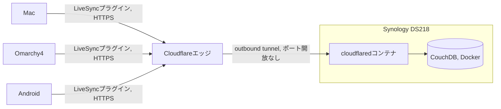

# Self-hosted LiveSync のclient-server構成は維持し、CouchDBのホスティングをSynology DS218 + Cloudflare Tunnelに移す

Vaultの同期はMac・今後用意するomarchy4・Androidの3端末をカバーする必要がある。
`obsidian-livesync`プラグインは既にVaultに導入済み（既存のCouchDBを向いている）だが、
そのCouchDBサーバーの自前運用が今回の調査で下げたかった管理コストの発生源だった。

検討して却下したもの:

- **Syncthing。** 無料・P2P・クラウドアカウント不要で、Mac/Arch/Android(Syncthing-Fork経由)にネイティブクライアントがあり、管理コスト最小の選択肢に見えた。実際に導入まで済ませていた（`brew`でインストール、Vaultフォルダを共有設定、`workspace.json`用の`.stignore`も作成）。導入後に却下: 会社ポリシーでP2Pプロトコルとして明確に禁止されていることが判明。この決定に至る前に、`Brewfile`のエントリ、`sh.brew.syncthing.plist`のLaunchAgent、`~/Library/Application Support/Syncthing`、Vaultの`.stignore`をすべて削除して完全に巻き戻し済み。
- **Obsidian公式Sync**（$4〜8/月）。管理コストは最も低く、モバイルを含む全プラットフォームをカバーする。却下: 継続課金を避けたいという希望による。
- **Git + Obsidian Gitプラグイン。** 無料でバージョン履歴が残り、この環境のgit中心のツール構成にも合う。今回は却下: プラグインがデスクトップ専用のため、Android側は別途ワークアラウンド（Termux + gitなど）が必要になり、既製の解決策がない。
- **クラウドストレージの同期クライアント**（Google Drive/OneDrive/Boxなど）。会社が既に承認済みのものがあれば有力だが、omarchy4（Arch）向けの公式Linuxクライアントの有無が未確認。保留（却下ではない）。

採用: **LiveSyncプラグインとそのCouchDBバックエンドは維持する** ——これはclient-serverのREST接続であり、ポリシーが対象とするP2Pメッシュプロトコルとは異なる —— その上で、CouchDBの*ホスティング先*だけを、既に所有しているSynology DS218に移し、LAN外からはポート開放ではなくCloudflare Tunnel経由でアクセスする。Androidについては追加のワークアラウンドは不要で、LiveSyncが元々ネイティブに対応している。

実装時に持ち越す注意点:

- DS218（DS218+ではない無印モデル）はRealtek RTD1296（ARM64、RAM 2GB）を搭載しており、SynologyのContainer Manager公式対応表には入っていない。Dockerを動かすにはコミュニティ製パッケージ（[007revad/ContainerManager_for_all_armv8](https://github.com/007revad/ContainerManager_for_all_armv8)）が必要で、DSMアップデートで壊れて再適用が必要になる可能性がある。
- CouchDBの`local.ini`で`bind_address = 0.0.0.0`と、`app://obsidian.md`・`capacitor://localhost`・`http://localhost`向けのCORS許可設定が必要。これがないとプラグインが接続できない。
- Synologyの証明書は自己署名のため、トンネルの公開ホスト名で「No TLS Verify」を有効化しないとCloudflare側で502になる。
- Cloudflare Tunnelはoutbound-only（ポート転送なし）で、Syncthingが引っかかったP2Pメッシュとは通信モデルが異なる。とはいえインターネットに公開されるエンドポイントであることに変わりはないので、手前にCloudflare Access（Zero Trust）ポリシーを置くべき。

未解決のOpen item: 自宅NASをトンネル経由で自己ホスティングすること自体が、Syncthingを禁止した社内ポリシーの範囲内か範囲外かはまだ確認できていない。ポリシーがP2Pプロトコルそのものを狙い撃ちしているのか、未承認の自己ホスティング全般まで含むのかによって結論が変わる。これは技術的な論点ではなくポリシー解釈の問題であり、NAS構築に着手する前にIT/セキュリティ部門の承認が必要。
