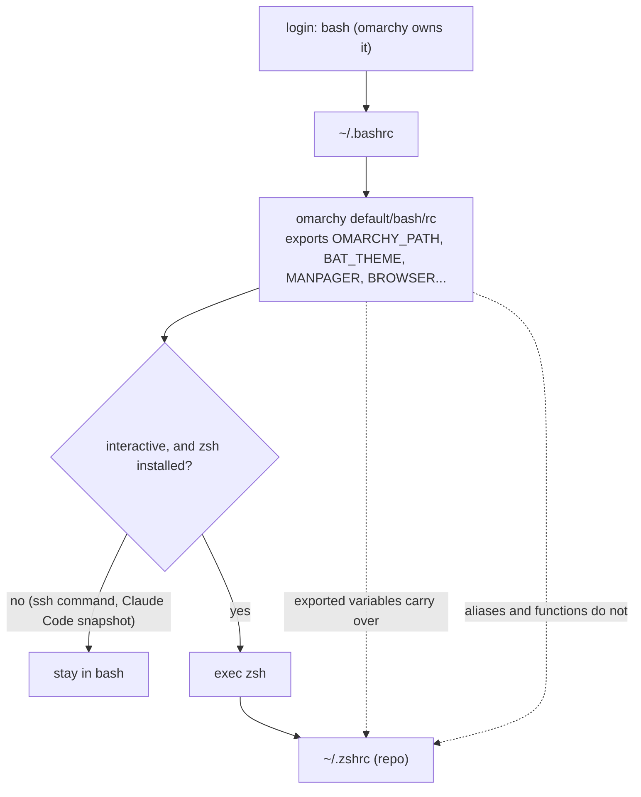

# Keep zsh on omarchy, entered from ~/.bashrc; keep omarchy-nvim

Revised 2026-10-01. The first version of this log chose bash and a new
`config/bash/rc`; the zsh setup (sheldon, zsh-abbr, autosuggestions, the `zle`
fzf widgets) is the part of the shell worth keeping, so the decision flipped.

Considered porting the zsh setup to bash (`config/bash/rc`). Rejected: bash has
no equivalent of autosuggestions or abbr (`blesh` exists in the AUR, but it
fights `bind -x` and fzf's own bindings), and the fzf widgets do not translate.
`ctrl+j` is already newline, `ctrl+v` is quoted-insert, `ctrl+_` is undo,
`ctrl+[` is the ESC byte, and `bind -x` cannot submit the line the way zsh's
`zle accept-line` does.

Considered `chsh` to zsh. Rejected in favour of a guarded `exec zsh` in
`~/.bashrc`: omarchy and its scripts assume bash as the login shell, and Claude
Code snapshots `~/.bashrc` non-interactively. The `[[ $- == *i* ]]` guard keeps
that snapshot, ssh commands and uwsm sessions in bash. `scripts/link.sh` appends
the block once, marked by a comment line. `omarchy-refresh-shell` may rewrite
`~/.bashrc`, so re-run `make link` afterwards.

What the exec buys and what it costs:

- Variables omarchy's bash exported reach zsh unchanged. `EDITOR` is the repo's
  own `nvim` (set in `zshrc`) rather than omarchy's `omarchy-launch-editor`.
  `BAT_THEME=ansi` takes precedence over `--theme` in `config/bat/config`.
- Aliases and functions do not carry over. omarchy's `default/bash/` provides
  the herdr layout helpers (`hdl`/`hds`/`hdlm`/`hsl`), `alias h='herdr'`, an
  ssh-reconnect wrapper, eza-based `ls` and a zoxide-backed `cd`/`zd`; none is
  available in zsh until ported. `aliases`, `envs`, `init`, `shell` and every
  file under `fns/` pass `zsh -n`, but nothing was run, and zsh arrays are
  1-indexed, which `fns/herdr` and `fns/tmux` rely on.
- `omarchy-zsh` was previously claimed to exist as a package; no package of that
  name was found in the official repositories or the AUR on 2026-10-01.
- `sheldon` and `zsh` are in the official `extra` repository.

Considered bringing this repo's hand-written `config/nvim/init.lua` (lazy.nvim
+ onedark + nvim-tree) instead of omarchy's default. Rejected: omarchy ships
`omarchy-nvim`, a maintained LazyVim setup wired into omarchy's own theme
switching. Using it means give up mac-identical nvim keybindings on omarchy;
worth it to stay on the maintained path instead of hand-rolling a second
config to keep in sync.
