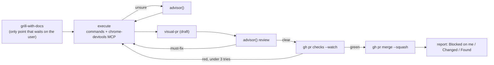

# llm/

Claude Code configuration for this repository, installed by `scripts/llm.sh`. See the root `CLAUDE.md` for the pointers into this directory; this file carries the reasoning behind them.

## Skills only, no commands

Reusable agent instructions live in `llm/skills/<name>/SKILL.md` only — there is no `llm/commands/` and no `~/.claude/commands` link. Slash commands and skills overlap in what they can express, but a skill carries a `description` that lets the model reach for it unprompted, so keeping both meant maintaining two mechanisms for one job.

`apply-review`, `create-pr`, and `create-repo` moved over from commands; `create-pr` was later replaced by the vendored `visual-pr` (below). Everything else was dropped once Claude Code shipped a built-in that already covered it — the standing test for whether a skill still belongs here:

- `review-pr` — the built-in `code-review` skill takes a PR number and can post or apply its findings.
- `guide` — plan mode explores read-only and presents options for approval, with the `Plan` and `feature-dev:code-architect` agents for the same job in a subagent.
- `empirical-prompt-tuning` — `claude plugin eval` runs eval cases with LLM graders, repeated runs, and a no-plugin ablation arm, and resolves a `~/.claude/skills/<name>` directory as a target.
- `find-skills` — `/plugin` and `claude plugin install` discover and install skills without the separate `npx skills` ecosystem it assumed.

`apply-review` survives the test because `code-review` generates its own findings rather than consuming a human reviewer's comments, and the `/pr-comments` command that once did is gone.

Add new instructions as `llm/skills/<name>/SKILL.md`, and use `disable-model-invocation: true` for the side-effecting ones (as `create-repo` does) instead of reintroducing a command.

`scripts/llm.sh` links each skill into `~/.claude/skills/` individually rather than linking the directory, so a skill added under `llm/skills/` appears only after `make llm`, and one removed or renamed leaves a dangling link to delete by hand.

## Vendored skills

`llm/upstream-skills.tsv` records the upstream commit each vendored skill (or hook directory) has been reviewed through. `scripts/llm.sh` prints a compare URL when upstream has moved past that commit; it applies nothing, because these are prompts that have to be read before they're taken. It fails open on a missing `gh`, an unreachable network, or a missing manifest.

### `visual-pr` (from `humanlayer/skills`)

Replaces the hand-written `create-pr`. What upstream is worth taking is the discipline it imposes on a PR body: the reason for the change in exactly one sentence, one to three reviewer warnings, and a change outline built from structural views (SQL and endpoint contracts, key types, pseudocode, a shallow file tree, component trees, call and data flow) instead of prose or a file-by-file changelog.

The local copy:

- drops upstream's HumanLayer assumptions (`.humanlayer/tasks/` body paths, a cloud permalink in the report) and its bundled second copy of `show-me` (which would have drifted from `llm/skills/show-me/`)
- re-adds what `create-pr` did and upstream does not: a draft PR assigned to `@me` against the detected default branch, `gh pr view --web`
- leaves a repository's own `.github/PULL_REQUEST_TEMPLATE.md` in charge of the headings when one exists, placing the structural views inside its sections rather than overwriting them with the three-section form

`create-pr`'s second template path, `${HOME}/dotfiles/.github/PULL_REQUEST_TEMPLATE.md`, was dropped rather than carried over — it has never existed on this machine.

Vendoring beat `claude plugin install` because none of those deviations survive a plugin update, and the plugin would write a `.humanlayer/` directory into every repository it ran in.

`show-me` is listed in the manifest too, pinned past `Make show-me user-invocable` — that commit adds `disable-model-invocation: true`, which `llm/AGENTS.md` needs off, and it had already landed upstream unnoticed before the manifest existed, which is the failure the manifest is meant to make visible.

### `retro` and `writing-for-agents` (from `mattpocock/skills`)

`retro`'s first step calls `writing-for-agents` for its style guide, so vendoring `retro` alone would leave that call dangling.

No built-in covers this gap: the built-in `code-review` skill reviews a diff against coding standards, while `retro` reviews the session and the agent's environment itself (steering files, missing automated checks, tool economy) to suggest what should change before the next session — a different input entirely.

Both ship `disable-model-invocation: true` upstream and keep it here: `retro` is genuinely user-invoked ("the user has asked for a retrospective"), and `writing-for-agents` is pulled in only to satisfy `retro`'s dependency, not for its own standing use, so neither should fire unprompted.

`writing-for-agents` governs the structure of agent-facing documents (context pointers, information hierarchy, leading words); it doesn't overlap `show-me`, which governs visuals inside those documents.

Upstream's `writing-for-agents/agents/openai.yaml` was dropped as an OpenAI-format export — the same call `visual-pr` makes dropping upstream's bundled second `show-me`.

`retro` graduated from upstream's `skills/in-progress/` to `skills/engineering/` (2026-03); the manifest path was updated to match, with no content change to vendor.

### `shut-up-and-code` (from `chl03ks/shut-up-and-code`)

Vendored for the same reason `visual-pr` exists: a `CLAUDE.md` line asking for comment restraint does not reliably stop the model from narrating code back to the user in comments (a known failure mode, cited in upstream's README against anthropics/claude-code#65961) — a skill loads as a document at the point the model decides how to write, where a config line competes for attention with everything else.

The skill alone still depends on the model choosing to invoke it, so `llm/hooks/shut-up-and-code-always-on.sh` and `llm/hooks/shut-up-and-code-audit-on-commit.sh` (vendored from the same upstream repo's `hooks/` directory) force the ruleset into context instead. See `scripts/llm.sh`'s comments for when each fires and how they're gated.

`llm/upstream-skills.tsv` tracks the skill and the `hooks/` directory as two separate rows against the same repo, since they can drift independently.

### `yomiyasu` (from `nanaism/yomiyasu`)

Rewrites AI-generated Japanese prose into natural Japanese: it restores the subject-verb-object structure AI output tends to drop, replaces figurative verbs (`壊れる`, `効く`, `溶かす`) with literal ones, and strips emoji, trailing colons, and excess bold/bullets. No built-in covers this — `code-review` and `writing-for-agents` govern structure and correctness, not Japanese prose register.

Upstream ships the skill twice: once at the repo root (for `npx skills add`) and once under `skills/yomiyasu/` (for its Claude Code plugin marketplace). The two are identical; the local copy is vendored from `skills/yomiyasu/` since that is the self-contained directory. Dropped: `.claude-plugin/` (plugin manifests, meaningless outside the marketplace flow) and `assets/algo-artis.png` (a logo image the skill itself never reads).

Upstream's `SKILL.md` warns against running it alongside other Japanese style/proofreading skills, since the instructions can conflict; disable one of them if that happens.

### `eli5` (from `DreambigOu/ELI5`)

Calibrates an explanation to a named audience (age, grade level, job role, relationship) instead of one fixed register. No built-in covers this — `claude-code-guide` answers questions about Claude Code itself, not about recalibrating an explanation's vocabulary and analogies for a given listener.

Upstream ships only the single `skills/eli5/SKILL.md` file; nothing was dropped or changed in the local copy.

## `autopilot` (adapted from `cursor/plugins` pstack)

Runs a task from requirements to a merged PR with one up-front interview and no further questions, except for the stop conditions listed in the skill. It is modelled on pstack's `poteto-mode` (`autonomous-run`, `opening-a-pr`, `shipping` and `never-block-on-the-human`) but is not vendored: pstack is a Cursor plugin built around a multi-model panel (grok for code, opus for judgment) and 23 playbooks, and neither carries over. Claude Code has one model plus `advisor()`, so the panel becomes an advisor consultation whenever evidence is thin and a PR review before merge.

No built-in covers this: `grill-with-docs`, `visual-pr`, `apply-review` and `code-review` each own one step, and nothing sequences them, defines the stop conditions, or merges.

Choices that deviate from pstack:

- Parallel work runs as Claude Code sessions in herdr panes rather than in-process subagents, so the user can watch and take over, and each pane has its own `advisor()`.
- Merge is gated on the exit condition, green CI and resolved must-fix items. `--admin`, force pushes and pushes to main stay outside the grant.
- It sets `disable-model-invocation: true` because it merges.

`autoMode.allow` in `~/.claude/settings.json` is per-machine and untracked, so the rule that lets the classifier accept `gh pr merge` is not in this repository. Without it, auto mode stops at the merge step.

## AutoHarness

`scripts/llm.sh` adds the `tigerless-labs/autoharness` marketplace and installs `autoharness@autoharness` (scope `user`), both idempotently via `claude plugin marketplace list --json` / `claude plugin list --json` checks. It is plugin-installed rather than vendored like the skills above: it ships a Python backend, an MCP server (`stage_skill`), and its own `SessionStart`/`Stop`/`PreToolUse`/`SessionEnd` hooks, none of which a skill-only copy under `llm/skills/` would run. It self-learns skills from session work into `.claude/skills/` and prunes them by usage rate — no local deviations are needed, so there is nothing to fork and no entry in `llm/upstream-skills.tsv`. A version bump needs `claude plugin marketplace update autoharness && claude plugin update autoharness@autoharness`, then a restart.

## herdr integration

`scripts/llm.sh` regenerates `llm/skills/herdr/SKILL.md` from `herdr --skill` on every run (git-ignored, so herdr upgrades do not show up as diffs), overrides its generated `description` (see the script's comments for why), and installs herdr's Claude Code integration hook plus the repository-owned `herdr-repo-workspace.sh` hook, which keeps herdr at "one repository = one workspace = side-by-side worktrees" (adapted from https://zenn.dev/gemcook/articles/herdr-worktree-parallel). `llm/AGENTS.md` carries the standing instruction that makes the herdr skill fire without being asked for each time.

## Status line

`llm/statusline.sh` is the Claude Code status line (model, repository, branch, context bar, rate limits, cost). `scripts/llm.sh` symlinks it to `~/.claude/statusline.sh` and adds the `statusLine` entry to `settings.json` only when none exists, so a machine that configured its own keeps it.

`llm/permissions-allow.json` lists the Bash rules (`make link` and the other `make` targets) that `scripts/llm.sh` unions into `permissions.allow` in `settings.json`. The merge runs on Linux only. Existing entries on a machine are kept.
